# Data Flow & Processing

## Overview

This document describes how data flows through the XYZ application, from user interactions to database operations and back to the presentation layer.

## Request Processing Flows

### 1. Standard Web Page Request

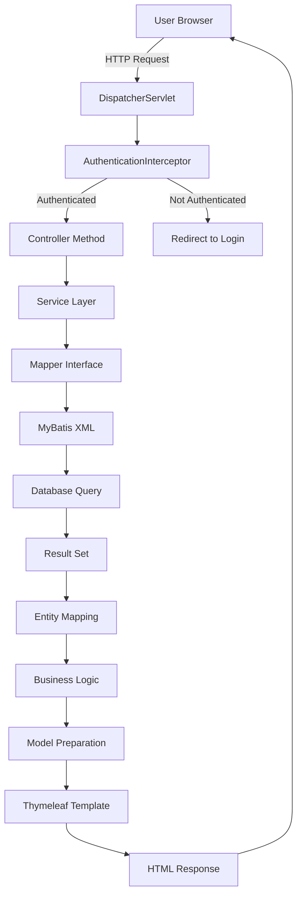

#### Detailed Steps:
1. **Request Reception**: Spring's DispatcherServlet receives HTTP request
2. **Authentication Check**: AuthenticationInterceptor validates session
3. **Route Mapping**: Controller method mapped via @RequestMapping
4. **Service Invocation**: Controller delegates to service layer
5. **Data Access**: Service calls mapper for database operations
6. **Query Execution**: MyBatis executes SQL and maps results
7. **Business Processing**: Service applies business logic
8. **Model Creation**: Controller prepares model for template
9. **Template Rendering**: Thymeleaf processes template with model
10. **Response Delivery**: HTML sent back to browser

### 2. AJAX API Request (Sidebar Data)

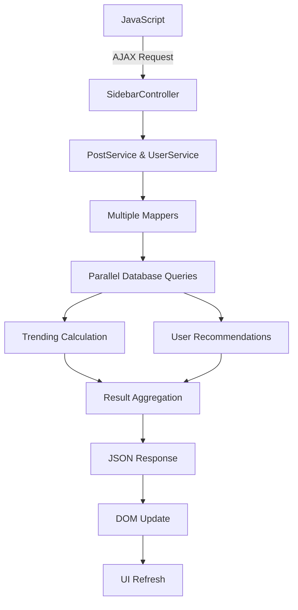

#### AJAX Flow Characteristics:
- **Asynchronous**: Non-blocking user interface
- **Parallel Processing**: Multiple queries executed simultaneously
- **JSON Response**: Lightweight data format
- **Dynamic Updates**: Real-time sidebar content refresh

### 3. User Authentication Flow

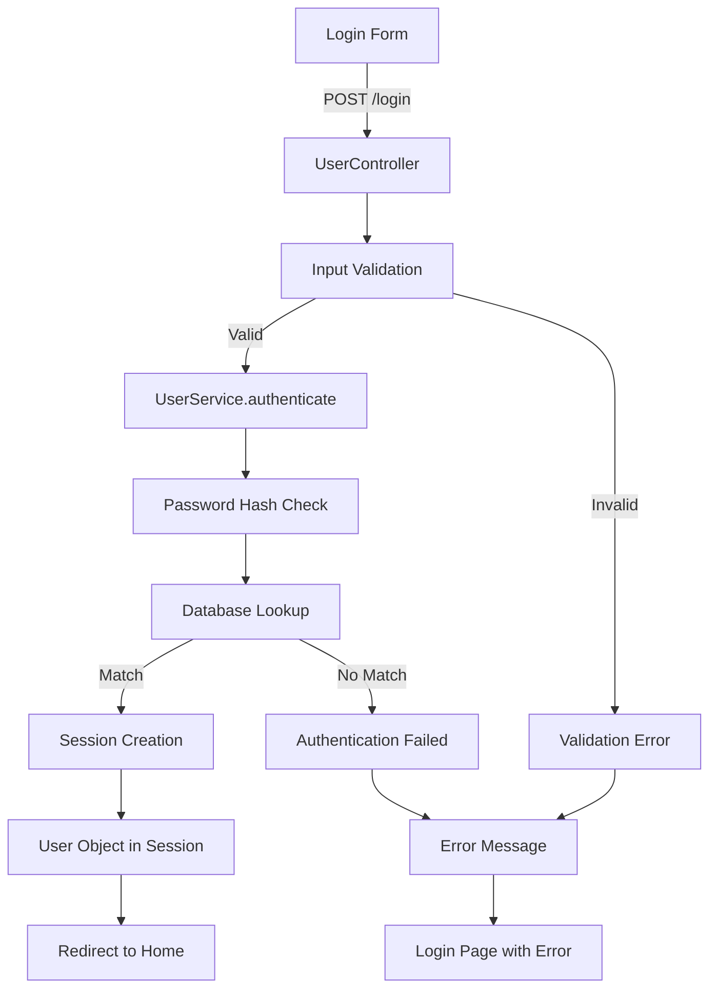

### 4. Post Creation Flow

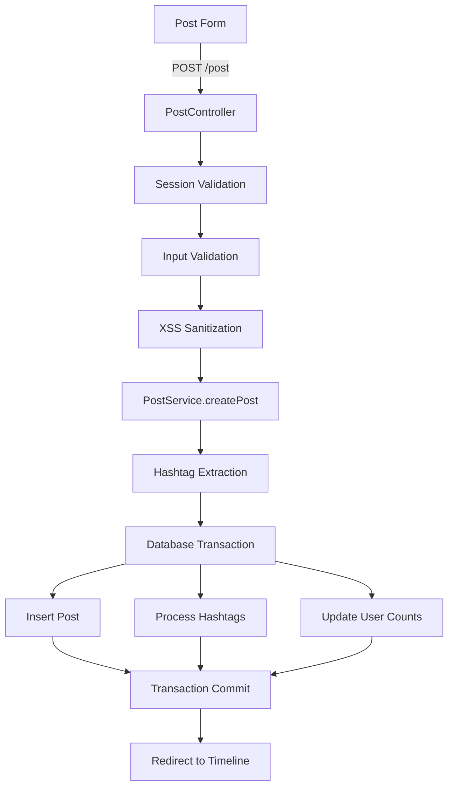

#### Transaction Management:
- **@Transactional**: Service layer manages database transactions
- **Rollback**: Automatic rollback on exceptions
- **Consistency**: All related operations succeed or fail together

## Authentication & Authorization Flow

### Session-Based Authentication

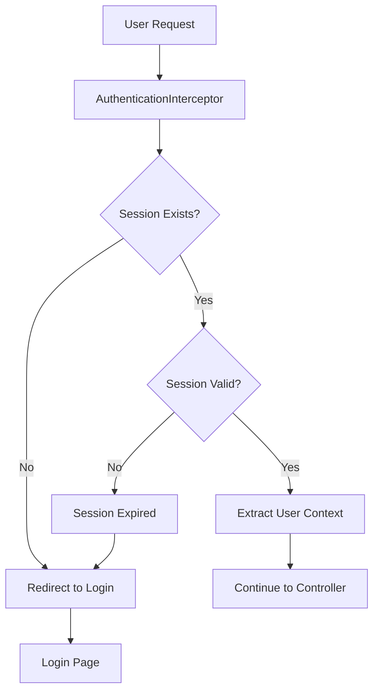

#### Session Management:
- **Session Creation**: Upon successful login
- **Session Storage**: Server-side session store
- **Session Timeout**: 30-minute automatic expiration
- **Session Validation**: Per-request authentication check

### Authorization Levels

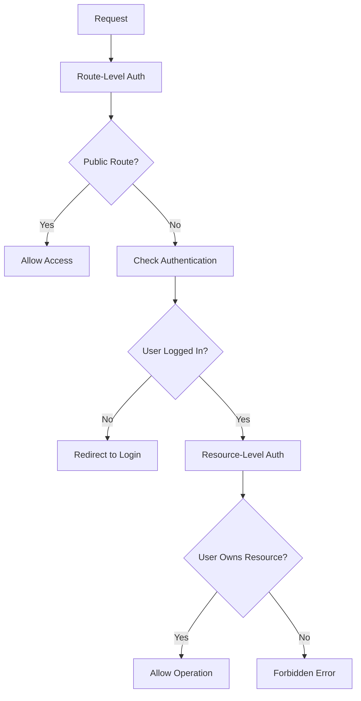

## Data Validation & Security Flow

### Input Processing Pipeline

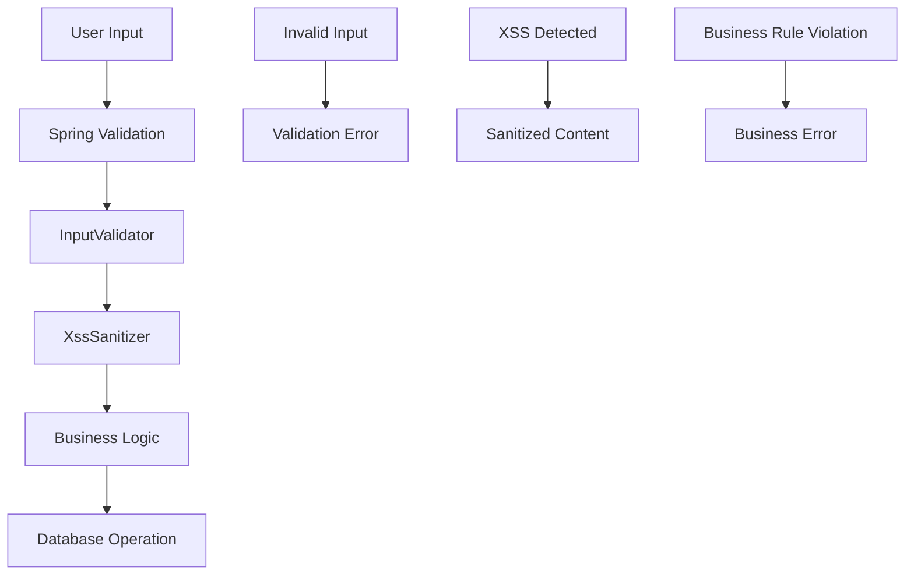

#### Validation Layers:
1. **Client-Side**: JavaScript validation for UX
2. **Controller**: Spring validation annotations
3. **Custom Validation**: InputValidator class
4. **XSS Prevention**: XssSanitizer processing
5. **Business Rules**: Service layer validation

### Security Processing

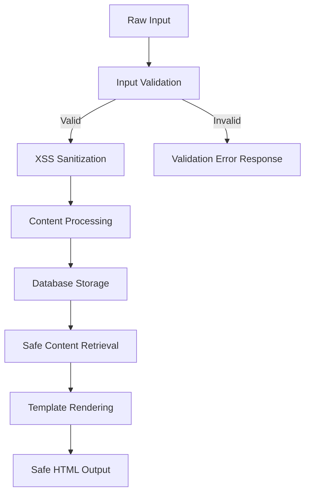

## Database Operation Flows

### Read Operations

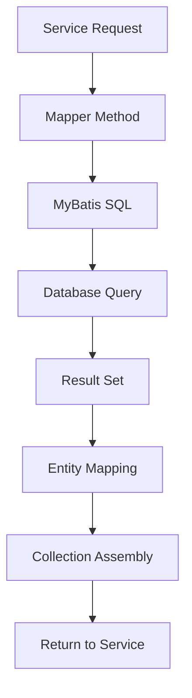

### Write Operations

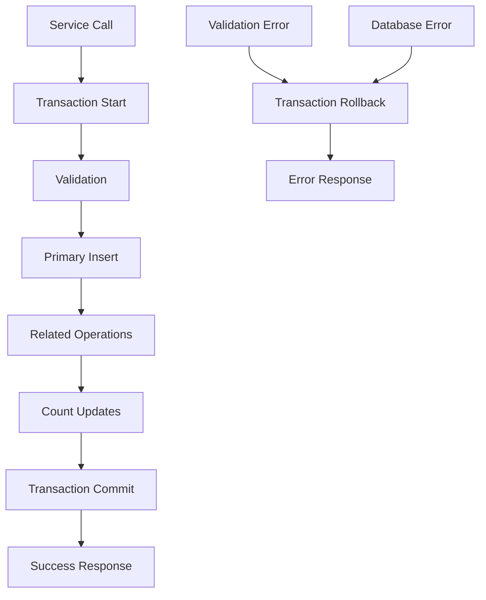

## Complex Operation Flows

### Timeline Generation

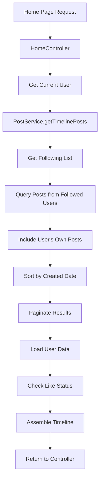

### Trending Hashtag Calculation

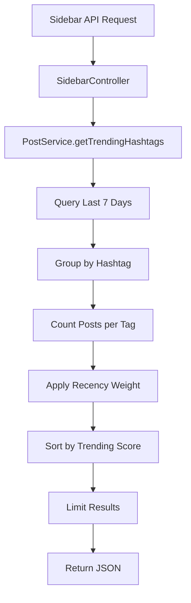

#### Trending Algorithm:
```sql
trending_score = post_count * EXP(-hours_since_last_post / 24.0)
```

### Message Conversation Flow

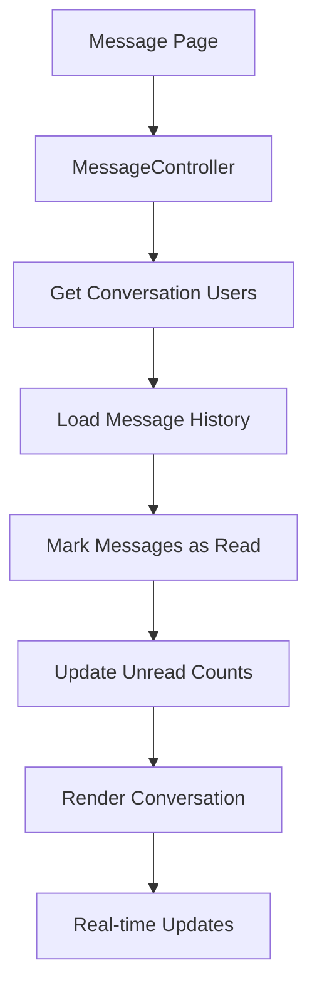

## Error Handling Flows

### Exception Processing

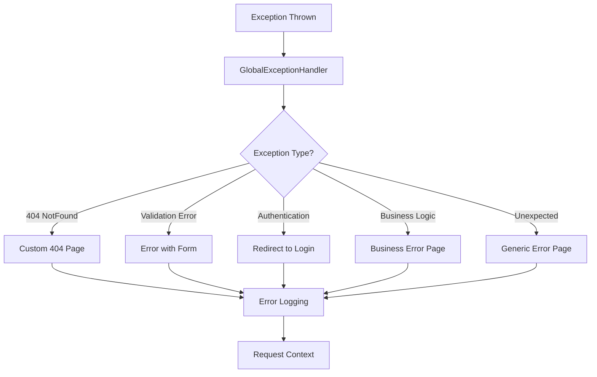

### Error Recovery Strategies

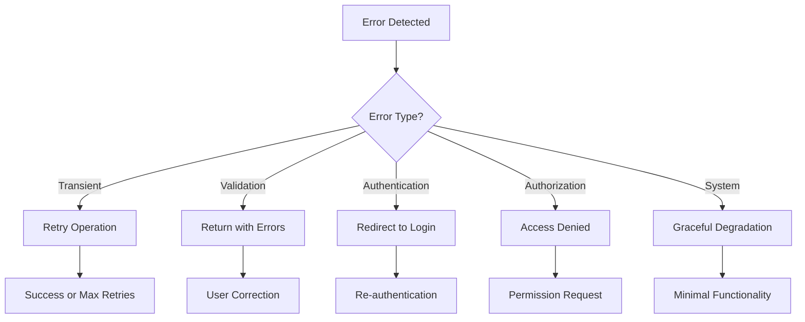

## Performance Considerations

### Database Connection Flow

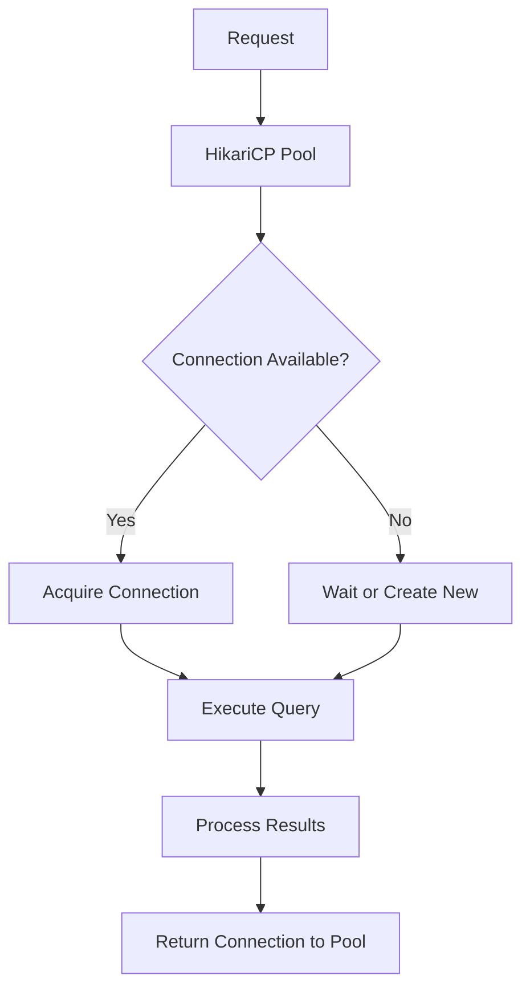

### Caching Strategy (Future)

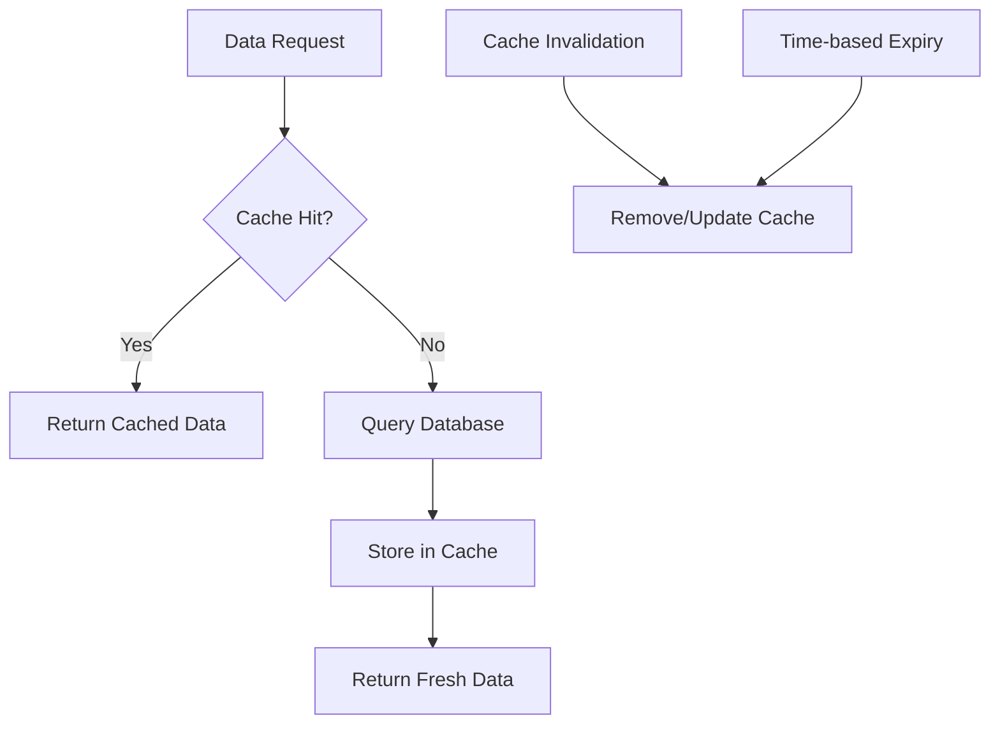

## Real-time Feature Flow

### Dynamic Sidebar Updates

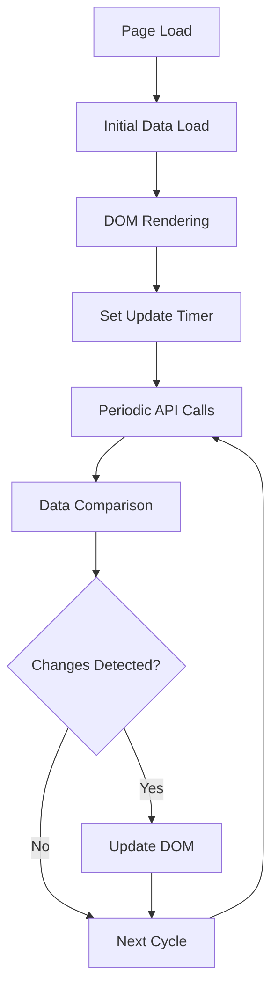

This comprehensive data flow documentation helps developers understand how information moves through the system and how different components interact to deliver the application's functionality.